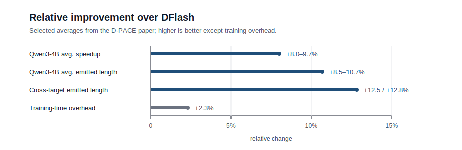
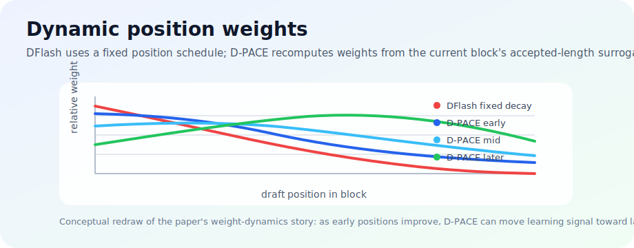

# D-PACE

**Dynamic Position-Aware Cross-Entropy for DFlash speculative drafting.**

This repository is based on [SGLang SpecForge](https://github.com/sgl-project/SpecForge) and adds D-PACE, a dynamic position-aware training loss for [DFlash](https://github.com/z-lab/dflash) models. D-PACE changes the training objective only: the drafter architecture, target model interface, and inference pipeline stay unchanged.

<p align="center">
  
</p>

## Method overview

D-PACE is a drop-in training objective for DFlash. It replaces the fixed position-decay schedule with example-dependent weights derived from a smooth accepted-length surrogate, so cross-entropy receives more signal at the positions that currently limit accepted length.

The loss follows a simple pipeline:

**draft confidence → smoothed prefix acceptance → suffix contribution weights → detached weighted CE**

<p align="center">
  
</p>

**Weight dynamics.** D-PACE recomputes position weights from the current draft confidences instead of using DFlash's fixed decay. As earlier block positions become more reliable, the training signal can move toward later positions that increasingly limit accepted length; the trajectory panel shows the corresponding MATH-500 emitted-length gains and component ablations.

## Results from the paper

Compared with the DFlash decayed-CE baseline, D-PACE improves both wall-clock decoding speedup (SR) and average emitted length (`tau`) without changing the inference pipeline.

- **Qwen3-4B main settings:** average SR improves by **+8.0% to +9.7%**.
- **Qwen3-4B main settings:** average emitted length improves by **+8.5% to +10.7%**.
- **Cross-target transfer:** average emitted length improves by about **+12.5%** on Llama-3.1-8B-Instruct and **+12.8%** on Qwen3-8B.
- **MATH-500:** up to **4.47x** speedup with the 5L Qwen3-4B drafter.

## Training

Use the existing SpecForge DFlash training entrypoint and select D-PACE explicitly:

For the Qwen3-4B experiments in the paper, the training data is
[z-lab/qwen3-4b-instruct-100k](https://huggingface.co/datasets/z-lab/qwen3-4b-instruct-100k).
Prepare it as the JSONL path expected by SpecForge and pass it through `--train-data-path`.

```bash
PYTHONPATH=. torchrun --standalone --nproc_per_node 8 \
  scripts/train_dflash.py \
  --target-model-path Qwen/Qwen3-8B \
  --target-model-backend sglang \
  --draft-config-path configs/qwen3-8b-dflash.json \
  --train-data-path cache/dataset/perfectblend_qwen3-8b_regen.jsonl \
  --output-dir outputs/qwen3-8b-dpace \
  --num-epochs 6 \
  --batch-size 4 \
  --learning-rate 6e-4 \
  --warmup-ratio 0.04 \
  --max-grad-norm 1.0 \
  --max-length 3072 \
  --chat-template qwen \
  --attention-backend flex_attention \
  --block-size 16 \
  --num-anchors 512 \
  --loss-type dpace \
  --dpace-alpha 0.5
```

Or start from the included example:

```bash
NUM_GPUS=8 DPACE_ALPHA=0.5 bash examples/run_qwen3_8b_dpace_online.sh
```

### Loss options

| `--loss-type` | Use |
| --- | --- |
| `dflash` | Existing DFlash decayed-CE path. Keeps `--loss-decay-gamma` compatibility. |
| `dpace` | Main D-PACE objective. |
| `dpace_p` | Cumulative-confidence-only component ablation. |
| `dpace_f` | Continuation-value-only component ablation. |

## Notes

- D-PACE is draft-only after target-generated training tokens / hidden states are available; it does not require target-probability hooks.
- This release intentionally keeps the public surface focused on the D-PACE method family.
- General SpecForge data preparation and training details still apply; see the upstream SpecForge documentation for broader framework usage.

## Acknowledgements

This codebase is adapted from [SGLang SpecForge](https://github.com/sgl-project/SpecForge). D-PACE builds on the [DFlash](https://github.com/z-lab/dflash) parallel speculative drafting setting, and the Qwen3-4B training experiments use the [z-lab/qwen3-4b-instruct-100k](https://huggingface.co/datasets/z-lab/qwen3-4b-instruct-100k) dataset. We thank the SpecForge/SGLang and DFlash contributors for the systems and research foundations this implementation builds on. We also thank Professor Minlan Yu for GPU support during the initial experiments.
